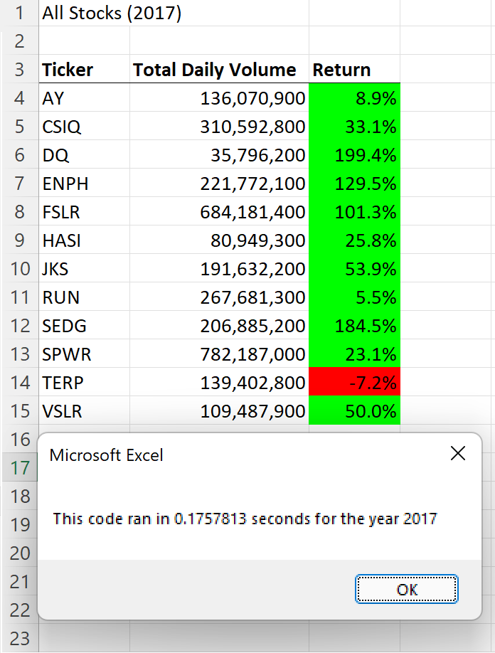
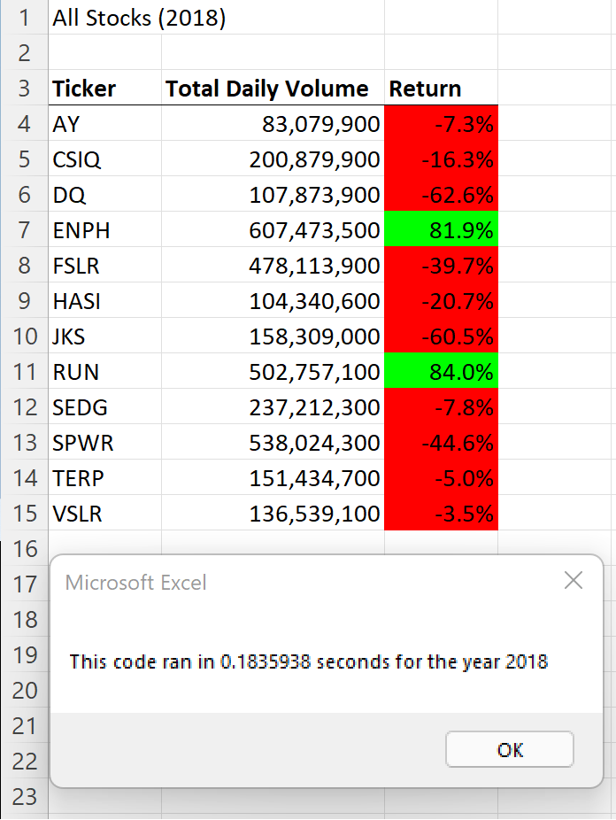
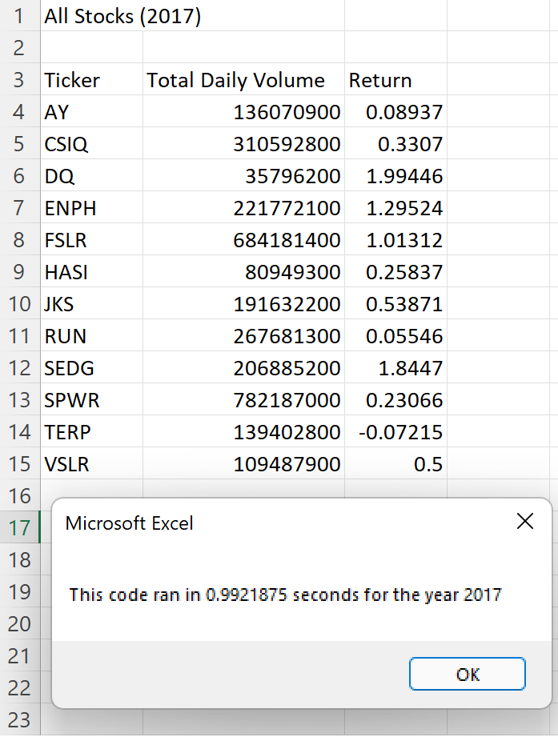
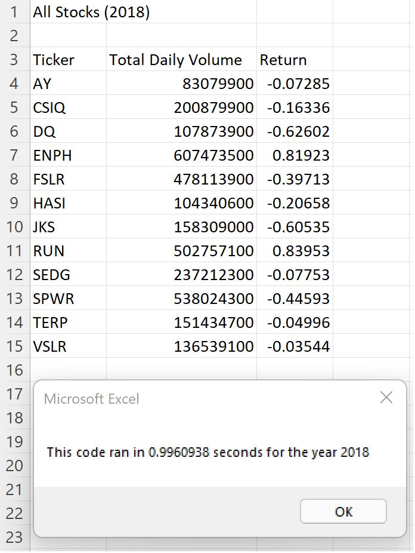

# Stock Analysis

## Table of Contents
- [Overview of Project](#OverviewProject)
  * [Background](#Background)
  * [Purpose](#purpose)
- [Results](#results)
  * [Stock Performance](#stockper)
  * [Code Performance](#codeper)
- [Summary](#summary)
- [References](#references)

## Overview of Project

### Background

Steve, a financier, is helping his clients who want to invest in DAQO New Energy Corp (DQ). He is wanting to analyze a handful of other green energy stocks to see if there's a better stock to invest in. 

A macro was prepared for Steve to run this analysis, yet as part of this project we offered faster performance in the code. 

### Purpose

The purpose of this analysis is to determine which would be the best stock to purchase.  Additionally, the refactored code will be compared agaist the original code to better understand its benefits and pitfalls. 

## Results

### Stock Performance

From the analyzed data we found that 2017 was a much better year for trading these set of stocks than 2018. In 2017, eleven out of the twelve stocks increased in price. In 2018 only two of the stocks increased in price, and all of the other stocks decreased in price. 

The two stocks that increased in price both years were ENPH and RUN. ENPH increased in price by 129% in 2017 and 81% in 2018. Where as RUN had a 5% increase in 2017 and an 84% increase in 2018. 

DQ, in contrast, increased in price 199.4% in 2017 but in 2018 the price dropped 62.6%. 

  

 Figure 1: Refactored Code Outcome for 2017
 

  

 Figure 2: Refactored Code Outcome for 2018
 

### Code Performance

In order to better serve the clients, the code performance should be taken into consideration. 

In the original code, embeded loops were used. The outside loop went though all 12 different stocks. The inside loop evaluated all of the rows in the code. There are about 3,000 rows in our data sets for both the 2017 year and the 2018 year. In this nested loop, the code evaluates all of the rows for every different stock, so that means there are aproximately 36,000 iterations. This code took 0.99 seconds to evaluate the 2017 and the 2018 stocks. And it required a different macro to format the tables. 

  

 Figure 3: Embeded Loop Code Outcome for 2017
 

  

 Figure 4: Embeded Loop Outcome for 2018
 

Our new code uses a conditional statement to evaluate if the data is moving into the next set of stocks rather than a for loop. Therefore passing though each row only once. The code has only approximately 3,000 iterations. 

In the process of finding the most efficient code, I went through three versions of refactored code. In the first version, I used three different if statements to determine the starting price point in the year for each stock, the ending price point and total volume of daily trades. 

In the second version, I used a nested if statement to get the same information, yet because I arranged the evaluations in a more complicated way my time actually increased than having separate if statments. 

In the third version, I re-arranged the if statement in the nested loop in such a way that it would reduce the amount of evaluations done. This one gave me marginally faster results. Additionally, by reducing the number of times that we evaluate if we are evaluating the right stock we reduce the potential of errors when maintaining code in the future. 

The results in all of those versions did not change. 

...

        If Cells(i - 1, 1).Value <> tickers(tickerIndex) And Cells(i, 1).Value = tickers(tickerIndex) Then
            tickerStartingPrices(tickerIndex) = Cells(i, 6).Value
            tickerVolumes(tickerIndex) = tickerVolumes(tickerIndex) + Cells(i, 8)
        
            ElseIf Cells(i + 1, 1).Value <> tickers(tickerIndex) And Cells(i, 1).Value = tickers(tickerIndex) Then
                tickerEndingPrices(tickerIndex) = Cells(i, 6).Value
                tickerVolumes(tickerIndex) = tickerVolumes(tickerIndex) + Cells(i, 8)
                tickerIndex = tickerIndex + 1
                
                ElseIf Cells(i, 1).Value = tickers(tickerIndex) Then
                    tickerVolumes(tickerIndex) = tickerVolumes(tickerIndex) + Cells(i, 8)
                    
        End If          
...

...

        If Cells(i, 1).Value = tickers(tickerIndex) Then
            tickerVolumes(tickerIndex) = tickerVolumes(tickerIndex) + Cells(i, 8)
        End If       
      
        If Cells(i - 1, 1).Value <> tickers(tickerIndex) And Cells(i, 1).Value = tickers(tickerIndex) Then
            tickerStartingPrices(tickerIndex) = Cells(i, 6).Value
        End If
               
        If Cells(i + 1, 1).Value <> tickers(tickerIndex) And Cells(i, 1).Value = tickers(tickerIndex) Then
            tickerEndingPrices(tickerIndex) = Cells(i, 6).Value
            tickerIndex = tickerIndex + 1
        End If

...

...

        If Cells(i, 1).Value = tickers(tickerIndex) Then
            tickerVolumes(tickerIndex) = tickerVolumes(tickerIndex) + Cells(i, 8)
        
            If Cells(i - 1, 1).Value <> tickers(tickerIndex) Then
                tickerStartingPrices(tickerIndex) = Cells(i, 6).Value
                
                ElseIf Cells(i + 1, 1).Value <> tickers(tickerIndex) Then
                    tickerEndingPrices(tickerIndex) = Cells(i, 6).Value
                    tickerIndex = tickerIndex + 1
            End If
    
        End If
...

The way all of these codes are written assumes that the data has been order such that all stocks are grouped together. A potential improvement for future macros would be to include a task that ensures that all of the data is organized by stocks. 

## Summary

As part of the data analysis we can conclude that investing in ENPH would've been the best stock to invest in 2017 and 2018.  

The refactored code reduced the iterations from aproximately 36,000 to approximately 3,000 making the code faster by a factor of 10 without changing the results. 

Although in this case the refactored code did not have drawbacks, when refactoring the code there's always a potential of missing something downstream of the changes one makes. 

##  References

[1] [Stock Analysis Excel File](https://github.com/tamiespinosa/stock-analysis/blob/a36556cee6e784b0aa7973acf9afcac611f73115/VBA_Challenge.xlsm)

[2] https://docs.github.com/en/get-started/writing-on-github/getting-started-with-writing-and-formatting-on-github/basic-writing-and-formatting-syntax
